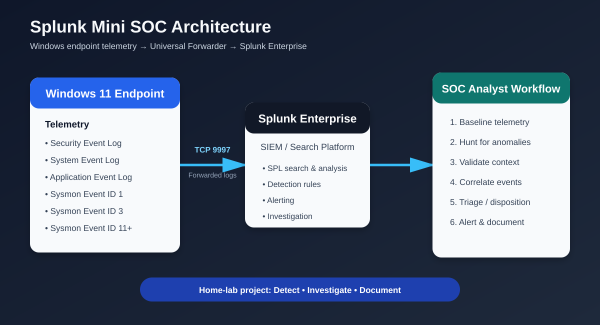

# Splunk Mini SOC — Windows Detection & Investigation Lab

A hands-on home Security Operations Center (SOC) project built with **Splunk Enterprise, Splunk Universal Forwarder, Windows 11, and Sysmon**.

The project demonstrates an end-to-end SOC workflow: collect telemetry, search it with SPL, create behavioral detections, validate alerts with controlled activity, investigate unusual events, correlate process/file activity, and document analyst conclusions.

> **Portfolio focus:** This repository documents work actually performed in the lab. Findings are classified from observed telemetry rather than treating every unusual executable as malicious.

## Objectives

- Build a functional Windows-to-Splunk security monitoring pipeline.
- Collect Windows Security, System, Application, and Sysmon telemetry.
- Write SPL searches for investigation and threat hunting.
- Create and validate behavioral detections and Splunk alerts.
- Investigate suspicious-looking activity using process context and timelines.
- Practice false-positive analysis and analyst disposition.
- Produce evidence suitable for a cybersecurity/SOC portfolio.

## Architecture



```text
Windows 11 Target
  ├── Windows Event Logs
  └── Sysmon
        │
        ▼
Splunk Universal Forwarder
        │ TCP/9997
        ▼
Splunk Enterprise
  ├── SPL Search & Hunting
  ├── Detections & Alerts
  └── Investigation / Analysis
```

## Lab Environment

| Component | Role |
|---|---|
| Ubuntu 26.04 host | Virtualization host |
| Ubuntu 24.04.4 VM | Splunk Enterprise server |
| Windows 11 Pro | Monitored endpoint |
| Splunk Enterprise 10.4.2 | SIEM/search/alerting platform |
| Splunk Universal Forwarder 10.4.2 | Windows log forwarder |
| Sysmon | Endpoint telemetry |
| VirtualBox Host-Only network | Lab communication |

The Splunk VM used a dedicated Ubuntu 24.04 VM rather than the Ubuntu 26.04 host. The Splunk receiver was configured on TCP **9997**.

## Telemetry Collected

### Windows Event Logs

- Security
- System
- Application

### Sysmon

The lab received Sysmon XML events including:

- **Event ID 1 — Process Creation**
- **Event ID 3 — Network Connection**
- **Event ID 11 — File Create**
- **Event ID 12/13 — Registry activity**
- **Event ID 22 — DNS Query**
- Additional Sysmon events generated by the endpoint configuration

The Sysmon sourcetype observed in Splunk was:

`XmlWinEventLog:Microsoft-Windows-Sysmon/Operational`

## Validated Detections

### D01 — Possible Brute-Force Authentication

Detects repeated Windows failed logon events (Security Event ID 4625) for the same account/source within a five-minute bucket.

- Threshold: 5 or more failures
- Data source: Windows Security Event Log
- Validation: controlled wrong-password attempts
- Splunk alert: created and tested
- Result: alert appeared in Splunk Triggered Alerts

See [`DETECTIONS.md`](DETECTIONS.md).

### D02 — PowerShell Execution Policy Bypass

Detects actual Windows PowerShell process creation where the command line contains `-ExecutionPolicy Bypass`, while excluding Splunk's own `splunk-powershell.exe` helper process.

- Data source: Sysmon Event ID 1
- Validation: controlled PowerShell command using `-NoProfile -ExecutionPolicy Bypass`
- Analyst principle: the behavior is an investigation indicator, not proof of compromise

See [`DETECTIONS.md`](DETECTIONS.md).

## Threat Hunting & Investigations

The lab also included investigation of activity that initially looked unusual.

### `auditpol.exe` — Benign

`auditpol.exe` appeared frequently in process creation telemetry. Investigation showed it was running as `NT AUTHORITY\\SYSTEM` with the Wazuh agent as the parent and querying audit-policy subcategories. The activity was assessed as expected security telemetry collection.

**Disposition:** Benign / no detection created.

### `rundll32.exe` — Benign

`rundll32.exe` was investigated because it can be abused to execute DLL exports. Observed commands referenced Windows system DLLs such as `AppXDeploymentExtensions.OneCore.dll`, `CapabilityAccessManager.dll`, `Windows.StateRepositoryClient.dll`, and `PcaSvc.dll`. Parent-process analysis showed recurring Windows system activity, including `svchost.exe`.

A follow-up hunt for `rundll32.exe` command lines outside `System32` and `SysWOW64` returned no results during the examined 24-hour period.

**Disposition:** Benign / no detection created.

### `Firefox.exe` from Desktop — Investigated and Explained

A process-creation hunt identified:

`C:\Users\Harrycode\Desktop\Firefox.exe`

This was initially treated as a higher-interest lead because the executable was running from a user-writable Desktop location.

Process and file telemetry established the following timeline:

1. `Firefox.exe` executed from the Desktop under the user's account.
2. Its parent was `explorer.exe`, consistent with an interactive launch.
3. A Mozilla Firefox updater subsequently launched `uninstall\\helper.exe`.
4. The helper used `/PostUpdate /DesktopLauncher` and wrote `Desktop\\Firefox.exe`.
5. The updater/helper binaries were located under the normal Mozilla Firefox installation directory.

**Disposition:** Likely benign Firefox update/desktop-launcher activity; no detection created.

See [`investigations/CASE-001-firefox-desktop-execution.md`](investigations/CASE-001-firefox-desktop-execution.md).

## Analyst Workflow Demonstrated

```text
Collect telemetry
      ↓
Search / baseline
      ↓
Identify unusual behavior
      ↓
Validate context
      ↓
Correlate process + parent + file activity
      ↓
Assess false positives
      ↓
Assign disposition
      ↓
Create detection only when justified
      ↓
Document evidence
```

## SPL Skills Demonstrated

- `search`
- `rex`
- `stats`
- `where`
- `bin`
- `rare`
- `timechart`
- Field extraction from XML Windows Event Logs
- Process/parent correlation
- Event ID analysis
- Time-bounded hunting
- Detection thresholding

See [`SPL-QUERIES.md`](SPL-QUERIES.md).

## Project Structure

```text
splunk-mini-soc/
├── README.md
├── DETECTIONS.md
├── SPL-QUERIES.md
├── architecture/
│   └── splunk-mini-soc-architecture.svg
├── investigations/
│   └── CASE-001-firefox-desktop-execution.md
└── reports/
    └── SOC-INVESTIGATION-REPORT.md
```

## Security / Lab Scope

All testing was performed against the user's own controlled Windows lab endpoint and local virtualized infrastructure. The controlled PowerShell and failed-authentication activity was generated for detection validation.

## Current Status

- [x] Splunk Enterprise deployed
- [x] Windows endpoint connected with Universal Forwarder
- [x] Sysmon telemetry ingested
- [x] Windows Security/System/Application logs ingested
- [x] Brute-force detection validated
- [x] PowerShell behavioral detection validated
- [x] Alerting tested in Splunk
- [x] Process and parent-process hunting performed
- [x] File/process timeline investigation performed
- [x] Investigation findings documented
- [ ] Email notification integration
- [ ] Additional dashboarding
- [ ] Additional endpoint/network detections

## Author

**Harrison Oodo** — Cybersecurity / SOC Analyst Candidate

This project is part of a broader cybersecurity home-lab portfolio focused on practical detection, monitoring, investigation, and incident-response skills.
